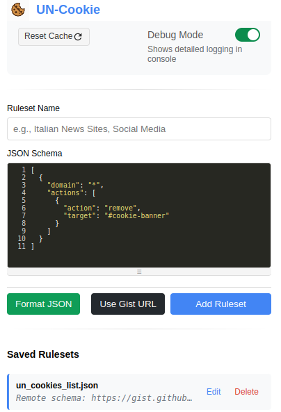

# UN-Cookie Browser Extension

A Chrome extension for managing cookie consent banners and notifications using configurable JSON schemas.



## Features

- Remove cookie banners and consent popups automatically
- Custom rules using JSON schemas
- Support for remote schemas via GitHub Gists
- Debug mode for troubleshooting
- Counter showing total elements removed
- Domain-specific handling
- Supports both inline and remote rule definitions

## Configuration

Rules can be defined using JSON schemas in two ways:

1. Direct JSON schema:
```json
[
  {
    "domain": "mydomain.com",
    "actions": [{
        "action": "click",
        "target": "[data-role='b_decline']",
        "onSuccess": {
            "action": "remove",
            "target": "#cl-consent"
        }
    }]
  }
]
```

2. Remote schema (GitHub Gist):
```json
{
  "rulesetName": "my_ruleset.json",
  "schema": "https://gist.githubusercontent.com/user/gistid/raw"
}
```

### Actions

Available actions:
- `click`: Click an element
- `remove`: Remove an element
- `hide`: Hide an element
- `style`: Apply custom styles
- `delete-cookies`: Delete cookies
- `remove-class`: Remove CSS class

## Action Executor Examples

The following examples demonstrate various actions that can be executed using the action executor:

## Basic Actions

```json
{
  "action": "click",
  "target": "#accept-button"
}

{
  "action": "remove",
  "target": "#cookie-banner"
}

{
  "action": "hide",
  "target": ".cookie-notice"
}
```

## Style Actions

```json
{
  "action": "style",
  "target": "#consent-popup",
  "property": "display",
  "value": "none"
}

{
  "action": "style",
  "target": ".modal",
  "styles": {
    "opacity": "0",
    "visibility": "hidden",
    "display": "none"
  }
}
```

## Cookie Actions

```json
{
  "action": "clear-cookies",
  "target": "*"
}

{
  "action": "delete-cookies",
  "target": "cookieConsent"
}
```

## Global Style Actions

```json
{
  "action": "addGlobalStyle",
  "target": ".cookie-banner",
  "styles": {
    "display": "none",
    "visibility": "hidden"
  }
}

{
  "action": "removeGlobalStyle",
  "target": ".cookie-banner"
}
```

## Actions with Delay and Chaining

```json
{
  "action": "click",
  "target": "#accept-cookies",
  "delay": 1000,
  "onSuccess": {
    "action": "reload"
  },
  "onError": {
    "action": "hide",
    "target": "#cookie-modal"
  }
}
```

## Multiple Actions for a Domain

```json
{
  "domain": "example.com",
  "actions": [
    {
      "action": "remove",
      "target": "#cookie-notice"
    },
    {
      "action": "clear-cookies",
      "target": "*"
    }
  ]
}
```

## CSS Class Actions

```json
{
  "action": "remove-class",
  "target": "body",
  "className": "cookie-banner-visible"
}
```

## Logging Actions

```json
{
  "action": "log",
  "message": "Attempting to remove cookie banner"
}
````

## Development

1. Clone the repository
2. Open Chrome and navigate to `chrome://extensions/`
3. Enable "Developer mode"
4. Click "Load unpacked" and select the extension directory

## Contributing

1. Fork the repository
2. Create your feature branch
3. Commit your changes
4. Push to the branch
5. Create a Pull Request